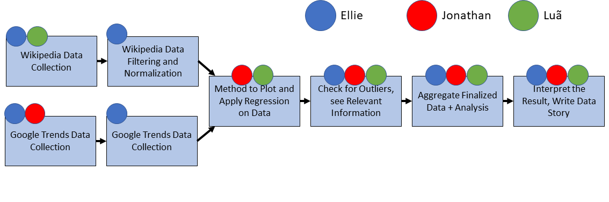

## Chilling effects: Online Surveillance and Wikipedia use
### Abstract
In our extension, we pursue similar goals as the authors of the original paper, but within a bigger context.
We want to see whether the chilling effects observed by the authors are limited in time and location.
To do so, we use Google Trends as a new data source, allowing us to analyze global information for up to 10 languages and during a wider time range.
Since this data will span over a longer time period, we will also (re)analyse the English Wikipedia data over the extended time period, and use it as a baseline to compare against.

We expect chilling effects to be more pronounced in the US and in Arabic countries than in countries being less affected by the "war on terror" and therefore presumably the NSA surveillance.
However, it is not clear and would be interesting to see what chilling effects exist for those who live on the fringe of the NSA's radar. 

### Research Questions
- Are the observed chilling effects only present on Wikipedia or can they also be observed on Google Trends?
- Are the chilling effects long-lasting, or do they disappear after an extended period of time? (to answer this, we will use extended English Wikipedia data)
- What are the different patterns of chilling effects accross different languages? (to answer this, we will use data from Google Trends in many languages)

### Proposed dataset
We will use the 48 topics listed on the paper to retrieve data starting from the 1st of January 2011, ideally until 2020 or December 2019.

1. Google Trends: we will translate each topic name to many languages (we are thinking of English, German, French, Italian, Spanish, Russian, Japanese, Portuguese, Arabic and Hindu) by using the correponsing Wikipedia article names in those languages, and then query the global trends for each topic.
2. Wikipedia: we will simply access the pageviews for the 48 topics in English, over this extended time period.

We will get the data from the public APIs of Wikipedia, and from a python library for Google Trends.
We'll apply a similar preprocessing phase for the data as described in the paper, and try to identify potential outliers.
We expect both the new Wikipedia data and the Google Trends data to be similar to the data in the paper.

* [Wikipedia dumps API](https://dumps.wikimedia.org/other/analytics/)  
* [Google Trends API Python wrapper](https://pypi.org/project/pytrends/)

Example code:
```
from pytrends.request import TrendReq

trends = TrendReq()
trends.build_payload(kw_list=['Terrorism', 'Fatah', 'Al-Qaeda'], timeframe='2012-01-01 2016-12-31')
df = trends.interest_over_time()
```

Data size shouldn't be a problem since we're limiting our scrapping to those 48 topics presented in the original paper, and each time series should only be around 60 months long.

### Methods

As in the paper, we will use an interrupted time series (ITS) analysis to study the data trends before and after the June 2013 NSA revelations.
This technique allows us to see if there are any trend changes, and whether these trends are significant.

### Proposed timeline

Week 1: Data collection and scrapping

Week 2: Method design and Data processing

Week 3: Data analysis and interpretation, report writing

### Organization within the team


### Questions for TAs (optional)
Already asked :)
