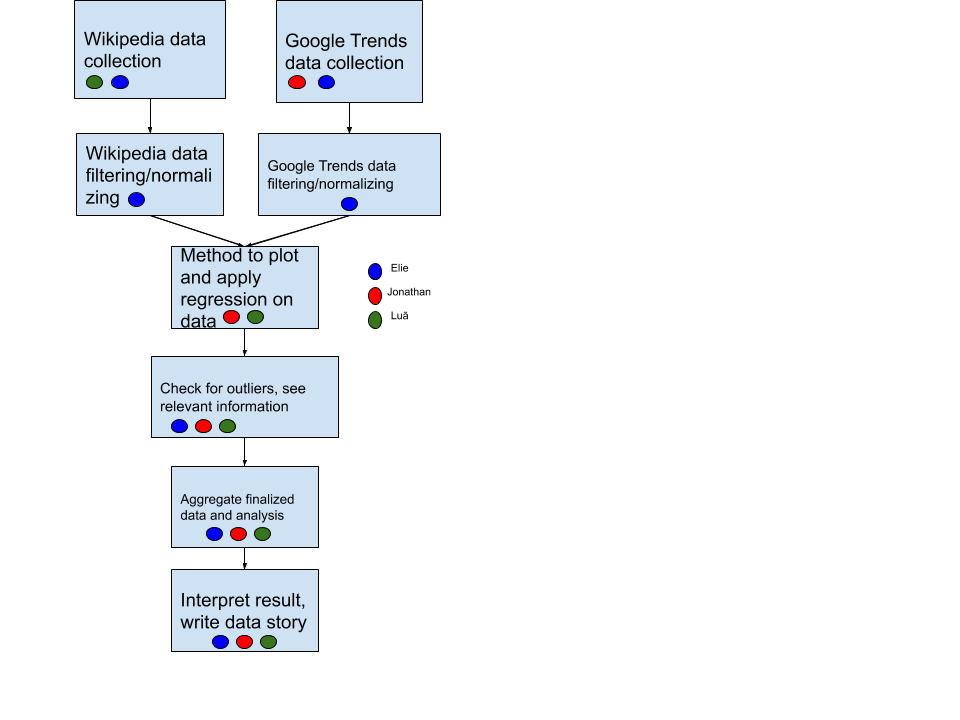

## Chilling effects online surveillance and Wikipedia use
### Abstract
We would like to pursue the same goals as the authors, but within a bigger context.
Our goal is to see whether the chilling effect observed by the authors is limited in time and location or whether it can be generalized to a broader context. To do so, we observe Google Trends as additional data source, analyze global information for up to 10 languages and a wider time range than the original paper for both data sources, Wikipedie Time Series and Google Trends.

We want to detect differences in the apperance of chilling effects all around the globus, explain then and speculate about possible reasons for them. We also want to further support the theory of chilling effects by strengthening the argumentation by the use of more data.
For instance, we expect there to be more pronounced chilling effects on the US (and maybe other English-speaking countries), and in Arabic countries.
However, it is not clear and would be interesting to see what chilling effects there are for those who live on the fringe of the NSA's radar. 

### Research Questions
- Are the chilling effects long-lasting, or do they disappear after an extended period of time? (to answer this, we will use extended Wikipedia data)
- Are the observed chilling effects only present on Wikipedia or can they also be observed on Google Trends?
- What are the different patterns of chilling effects accross different countries and languages? (to answer this, we will use data from many languages and countries)

### Proposed dataset
We would like to use the 48 topics listed on the paper to retrieve:
1. English, German, French, Italian, Spanish, Russian, Japanese, Portuguese, Arabic and Hindu Wikipedia data from January 2011 to January 2016.
2. Google Trends data from January 2011 to January 2016.

We will get the data from the public APIs of Wikipedia and Google Trends.
From Wikipedia, we will retrieve the pageviews for the 48 articles accross the previously listed languages.
From Google Trends, we will retrieve the search time series for the 48 topics, accross different regions of the world (and translating the topics to adapt to the region).
We'll apply a similar preprocessing phase for the data as described in the paper, and try to identify potential outliers.
We expect the Wikipedia data to be similar to the data in the paper, for all languages.

* [Wikipedia dumps API](https://dumps.wikimedia.org/other/analytics/)  
* [Google Trends API Python wrapper](https://pypi.org/project/pytrends/)

Data size is not supposed to be a problem since we're limiting our scrapping to those 48 topics presented in the original paper, and each time series should be only around 60 months long.

### Methods

Interrupted time series (ITS) analysis to study the data trends before and after the June 2013 NSA revelations, and whether these trends are significant.

### Proposed timeline

Week 1: Data collection and scrapping

Week 2: Method design and Data processing

Week 3: Data analysis and interpretation, report writing

### Organization within the team

### Questions for TAs (optional)

* How big must the outlier be for us to take it into account? Since we have multiple languages there's a very large number of possible outliers.
* Are there too many / too few research questions?
* How should we interpret the p-values of some ITS fits?
